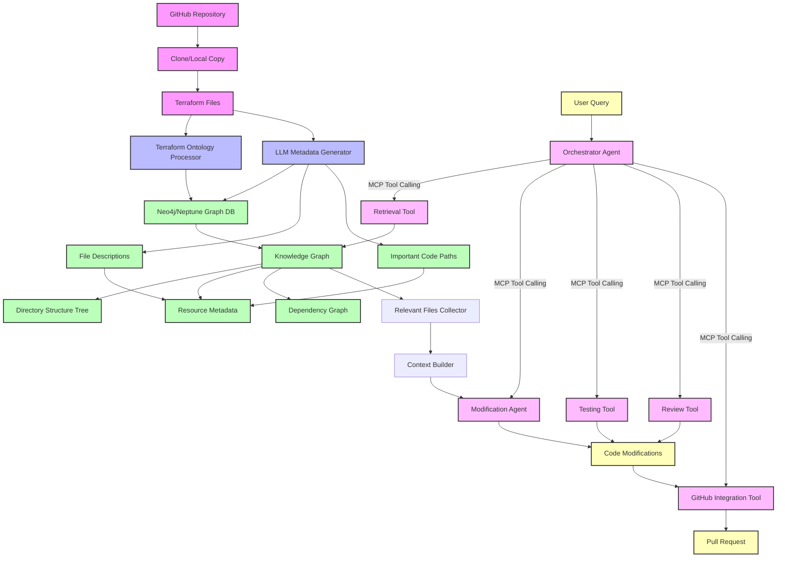

1. **Storing Customer Codebases**: I will be first creating an ontology for the Terraform code, and the cloned repository will pass through it which creates the index for the complete codebase. It will be stored in Neo4j or Neptune as required. This approach allows us to represent and query the relationships between different Terraform resources, modules, and configurations efficiently without duplicating the entire codebase.

2. **Fetching Relevant Files**: When creating the knowledge graph, we will actually create metadata for each file using an LLM that will create the description of a file and the important code paths there. Along with the knowledge graph for the whole file structure, we will have a tree which would give the directory structure. This metadata-driven approach allows us to quickly identify and retrieve only the most relevant files based on the user's prompt, significantly reducing the context size passed to the LLM.

5. **Agent Architecture**: For agents, there will always be an orchestrator who will take the query, decide which actions to take, and I would highly suggest using MCP (Model Context Protocol) for tool calling which will make things unified. This orchestrator can delegate to specialized agents for parsing code, making modifications, testing changes, and managing GitHub interactions, creating a modular system that's easy to maintain and extend.

This approach combines the power of knowledge graphs for code representation with specialized agents to handle different parts of the workflow, all coordinated through a central orchestrator using standardized communication patterns.

### High level architecture

